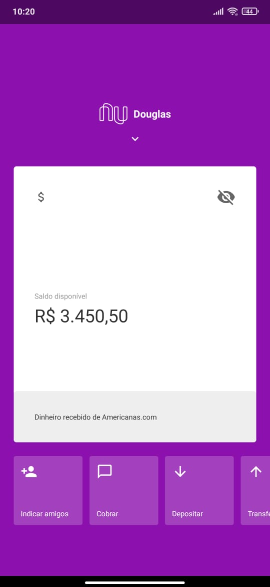
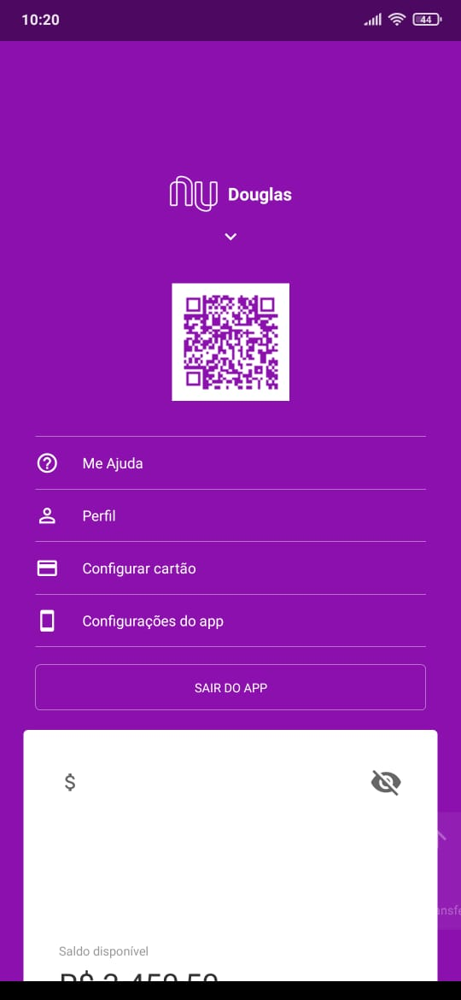

# Nubank Clone
Réplica do app de cartão de crédito Nubank para fins de aprendizado

# Sobre 
O objetivo desse app é puramente para fins educacionais de aprendizado, ele foi construído com base no app do Nubank (utilizando a versão antiga do mesmo), ele possui algumas animações que são utilizadas na aplicação original, como um fade de opacidade e uma translação do card branco de saldo. Este app não possui funcionalidades de persistência ou qualquer tipo de acesso à dados, ele é apenas um modelo de interface gráfica (GUI).

# Demo
| Tela inicial | Menu
| --- | --- |
|||

# Tecnologias
- [React Native](https://reactnative.dev/) - Uma das bibliotecas mais utilizadas  pelos desenvolvedores para criação de app nativo para Android e iOS

- [React Native Gesture Handler](https://www.npmjs.com/package/react-native-gesture-handler) - API do ReactNative para manipular gestos e toques na tela 

- [Animated](https://reactnative.dev/docs/animated) - Biblioteca nativa do React Native para fazer animações gráficas

- [React Native QRCode Generator](https://www.npmjs.com/package/react-native-gesture-handler) - Biblioteca para geração de código QR baseado em uma string, podendo ser uma url ou código qualquer

# Executando
```sh
cd nubank-clone

react-native run-android
```

<br>
Feito com 💜 por Emanuel Douglas 💻


